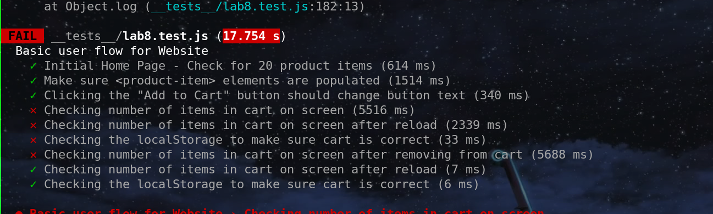

# Lab 8 - Starter
1) Where would you fit your automated tests in your Recipe project development pipeline? Select one of the following and explain why.

>Within a Github action that runs whenever code is pushed 

Everytime code is pushed would ensure that it would have a working part. It doesn't have to be in the development branch. But knowing when it fails gives some good info. Also, compared to doing it manually having it with Github actions seems much more efficient especially if you set it up once.

2) Would you use an end to end test to check if a function is returning the correct output? (yes/no)

Well, no right? I mean checking if a function is returning the correct output is what we are more familiar with right? And Unit Testing, not E2E, is described as "you test individual parts of your code in encapsulated units to make sure each part of your code is functioning as it should.", which is much more the checking if a function, an internal part, is working. E2E I imagine tests elsewhere.

